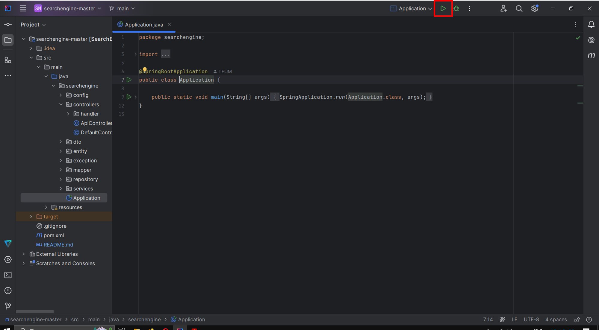

# search-engine
Проект представляет собой поисковой движок для веб-сайтов, состоящую из:
- Backend части на Java/Spring Boot
- Frontend интерфейса на HTML/CSS/JavaScript

## Описание проекта
Поисковый движок — это Spring-приложение, предназначенное для индексации и поиска информации на локальных сайтах. 
Движок обходит заданные сайты, индексирует их страницы, сохраняет данные в базу данных MySQL и предоставляет API для управления индексацией и выполнения поисковых запросов. 
Проект включает веб-интерфейс для удобного взаимодействия с пользователем.

## Функциональность
1. **Индексация сайтов**:
    - Обходит все страницы сайта, начиная с главной.
    - Сохраняет содержимое страниц в базу данных.
    - Выполняет лемматизацию слов и подсчёт их частот.
2. **Поиск**:
    - Обрабатывает поисковые запросы с учётом морфологии.
    - Сортирует результаты по релевантности.
    - Выводит сниппеты с выделенными совпадениями.
3. **Управление**:
    - Запуск и остановка индексации.
    - Добавление отдельных страниц в индекс.
    - Просмотр статистики.

## API Endpoints
Backend состоит из следующих REST API endpoints:
1. Статистика
- GET /api/statistics - возвращает статистику по проиндексированным сайтам
```json
{"result": true}
```
2. Управление индексацией
- GET /api/startIndexing - запускает полную индексацию сайтов
```json
{"result": true}
```
- GET /api/stopIndexing - останавливает текущую индексацию
```json
{"result": true}
```
- POST /api/indexPage - индексирует отдельную страницу

| Параметр | Тип      | Обязательный               | Описание                 |
|----------|----------|----------------------------|--------------------------|
| url      | string   | Да                         | Индексированная страница |
3. Поиск
- GET /api/search - выполняет поиск по индексу

| Параметр | Тип      | Обязательный                      | Описание             |
|----------|----------|-----------------------------------|----------------------|
| query    | string   | Да                                | Поисковый запрос     |
| site     | string   | Нет (по умолчанию по всем сайтам) | Индексированный сайт |
| offset   | integer  | Нет (по умолчанию 0)              | Смещение результатов |
| limit    | integer  | Нет (по умолчанию 20)             | Лимит результатов    |

## Детали реализации

### Индексация страниц
- Jsoup парсит HTML, извлекая текст и ссылки.
- Обход сайтов по извлечённым ссылкам с учётом возможной рекурсии.
- Используется Fork-Join Framework для многопоточной обработки.

### Лемматизация
- Русские и английские слова приводятся к нормальной форме.
- Игнорируются служебные части речи.

### Хранение данных
- Данные хранятся в базе данных MySql. Применяется ORM.
- Предложен вариант использования разовой загрузки всех индексированных страниц из HashMap в базу данных.

## Стек технологий
- **Язык программирования**: Java
- **Фреймворк**: Spring Boot, Spring MVC, Spring Data, Hibernate
- **База данных**: MySQL
- **Библиотеки**:
    - Jsoup — для парсинга HTML-страниц.
    - Lombok — для упрощения кода.
    - Thymeleaf — для шаблонизации веб-страниц.
    - Lucene Morphology — для лемматизации слов.
- **Инструменты**:
    - Maven — для управления зависимостями.
    - Git — для контроля версий.

## Установка и запуск

### Требования
- Java 17+
- MySQL 8.0+
- Maven 3.6+

### Установка
```bash
git clone https://github.com/StLuka02022002/search-engine
```

### Запуск MySQL и создание базы данных
```sql
CREATE DATABASE search_engine 
```

### Открыть проект и запустить его в IDE


### Использовать сборщик Maven
```bash
mvn clean package
java -jar target/SearchEngine-1.0-SNAPSHOT.jar
```

### Использование движка
Откройте в браузере: http://localhost:8080